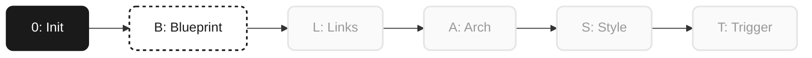

# 🚀 BLAST Progress — Brainstorm Tool

> **Status:** 🟡 Phase B (Blueprint)  
> **Progress:** `█████████░░░░░░░░░░░` 12/27 Tasks (44%)

---

### **0️⃣ Phase 0: Initialization** 🟢 *(Completed)*
- [x] Projektkontext erfasst
- [x] Scope definiert
- [x] Ordner scaffolded
- [x] README.md geschrieben
- [x] Zusammenfassung bestätigt

### **🅱️ Phase B: Blueprint** 🟡 *(In Progress)*
- [x] Anwendungsfall → AI-Pair-Brainstorming + Quellen
- [x] Plattform → Antigravity Artifact (Web/HTML)
- [x] Graph-Typ → Force-directed mit Clustering
- [x] Node-Tiefe → Progressive Depth, Glassmorphism-Dots (max 10)
- [x] Visueller Style → White, Dashboard, Nothing-inspired
- [x] Quellen-Integration → On-demand + Knowledge Export
- [x] Knowledge Loop → NotebookLM am Ende jedes Projekts
- **[ ] 🎯 Graph-Persistenz klären (Aktueller Fokus)**
- [ ] Interaktions-Modell finalisieren
- [ ] Design zusammenfassen und präsentieren
- [ ] Design-Doc schreiben
- [ ] User reviewed Spec

### **🔗 Phase L: Links** ⚪ *(Pending)*
- [ ] Dependencies identifiziert (D3.js, etc.)
- [ ] Referenzen gesammelt → `reference/`

### **🏗️ Phase A: Architecture** ⚪ *(Pending)*
- [ ] Graph-Engine implementiert (Force-Simulation)
- [ ] Node-Komponente mit Depth-Dots
- [ ] Cluster-Logik
- [ ] Session-Persistence (JSON)
- [ ] Funktionalität validiert

### **🎨 Phase S: Stylization** ⚪ *(Pending)*
- [ ] Design Tokens (White/Monochrome/Glass)
- [ ] Glassmorphism UI, Dashboard-Layout
- [ ] Responsive Design
- [ ] Visual Quality Check

### **🚀 Phase T: Trigger** ⚪ *(Pending)*
- [ ] Ordner-Audit bestanden
- [ ] Export-Funktion (HTML/JSON für Notion)
- [ ] Handoff-Notiz
- [ ] Knowledge Export → NotebookLM
