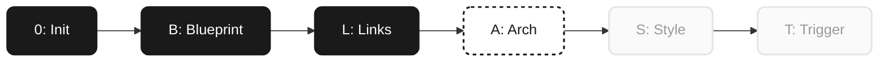

# 🚀 BLAST Progress — Brainstorm Tool

> **Status:** 🟡 Phase A (Architecture) — Bug-Fix Batch  
> **Progress:** `████████████████░░░░` 30/38 Tasks (79%)

---

### **0️⃣ Phase 0: Initialization** 🟢 *(Completed)*
- [x] Projektkontext erfasst
- [x] Scope definiert
- [x] Ordner scaffolded (Vite + React + TypeScript + Tailwind v4)
- [x] README.md geschrieben
- [x] Zusammenfassung bestätigt

### **🅱️ Phase B: Blueprint** 🟢 *(Completed)*
- [x] Anwendungsfall → AI-Pair-Brainstorming + Quellen
- [x] Plattform → Antigravity Artifact (Web/HTML)
- [x] Graph-Typ → React Flow mit Cluster-Zonen
- [x] Node-Tiefe → Progressive Depth, Glassmorphism-Cards (infinite)
- [x] Visueller Style → White monochrome, product-viz, frosted glass
- [x] Quellen-Integration → On-demand via Gemini API
- [x] Knowledge Loop → NotebookLM am Ende jedes Projekts
- [x] Graph-Persistenz → localStorage (Save/Load)
- [x] Interaktions-Modell finalisiert
- [x] Design-Doc geschrieben
- [x] User reviewed Spec ✅

### **🔗 Phase L: Links** 🟢 *(Completed)*
- [x] Dependencies: React Flow, Lucide, Tailwind v4
- [x] Gemini API Integration (gemini-2.5-flash)
- [x] API Key Management (localStorage + Modal)

### **🏗️ Phase A: Architecture** 🟡 *(In Progress)*

#### Batch 1: Core Infrastructure ✅
- [x] A1: Graph-Engine (React Flow) + Semantic Zoom
- [x] A2: Cluster-Zone-Nodes (SVG hatching patterns)
- [x] A3: Concept-Node with frosted glass cards
- [x] A4: Auto-clustering via Gemini (InfraNodus-style)
- [x] A5: Session persistence (JSON save/load)

#### Batch 2: Node Behavior ✅
- [x] A6: Title-only initial state (progressive reveal)
- [x] A7: "Explain" button → on-demand Gemini descriptions
- [x] A8: Expand same zone (A5 in-place expansion)
- [x] A9: Root "+" → add new clusters (A6)
- [x] A10: Progressive metadata (collapsible sources for deep nodes)
- [x] A11: Synergy research (connect 2 nodes → Gemini analysis)

#### Batch 3: Bug Fixes 🔧 *(Current)*
- [x] Z-index: Panels über Kanten, Zonen hinter allem
- [x] Multi-Handles: 4-seitige Andockstationen
- [x] Node-Jumping: extent:parent entfernt → freie Positionierung
- [x] Überlappung: Zone-Resizing bei Expansion
- [x] Explanation-Truncation: overflow-hidden entfernt, Card-Width expandiert
- [x] Image-Button: Für alle Tiefen verfügbar
- [ ] Auto-Image bei Erstellung (Root + Depth-1)

#### Batch 4: Polish ⚪
- [ ] A12: Depth-stacking Visual (3D stack effect)
- [ ] A13: Auto-Unsplash Images für Root/Cluster
- [ ] A14: Edge routing optimization

### **🎨 Phase S: Stylization** ⚪ *(Pending)*
- [ ] Final Design Token Audit
- [ ] Dark Mode refinement
- [ ] Responsive Design Check
- [ ] Visual Quality Check

### **🚀 Phase T: Trigger** ⚪ *(Pending)*
- [ ] Ordner-Audit bestanden
- [ ] Build-Test (npm run build)
- [ ] Export-Funktion (HTML/JSON für Notion)
- [ ] Deploy (Vercel/Cyon)
- [ ] Knowledge Export → NotebookLM
